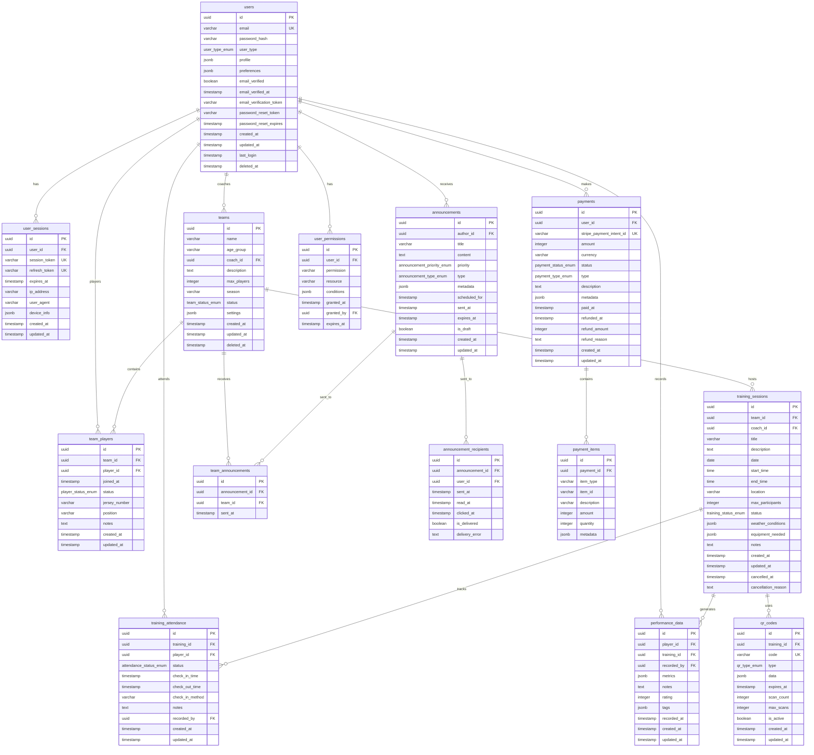

# Lion Football Academy - Database Schema Documentation

## Table of Contents
1. [Overview](#overview)
2. [Database Design Principles](#database-design-principles)
3. [Entity Relationship Diagram](#entity-relationship-diagram)
4. [Table Definitions](#table-definitions)
5. [Indexes and Constraints](#indexes-and-constraints)
6. [Views and Stored Procedures](#views-and-stored-procedures)
7. [Data Migration Scripts](#data-migration-scripts)
8. [Backup and Recovery](#backup-and-recovery)

## Overview

The Lion Football Academy database is designed using PostgreSQL (production) and SQLite (development) with a focus on data integrity, performance, and scalability. The schema supports multi-tenant architecture with role-based access control.

### Database Configuration
- **Production**: PostgreSQL 15+
- **Development**: SQLite 3.36+
- **Character Set**: UTF-8
- **Collation**: en_US.UTF-8
- **Time Zone**: UTC with application-level conversion

### Schema Versioning
- **Current Version**: 1.0.0
- **Migration System**: Custom Node.js migration scripts
- **Version Control**: Git-tracked migration files

## Database Design Principles

### Normalization
- **Third Normal Form (3NF)**: All tables follow 3NF to eliminate redundancy
- **Referential Integrity**: Foreign key constraints ensure data consistency
- **Data Types**: Appropriate data types for optimal storage and performance

### Naming Conventions
- **Tables**: Snake_case (e.g., `training_sessions`)
- **Columns**: Snake_case (e.g., `created_at`)
- **Primary Keys**: `id` (UUID)
- **Foreign Keys**: `{table_name}_id` (e.g., `user_id`)
- **Indexes**: `idx_{table}_{columns}` (e.g., `idx_users_email`)
- **Constraints**: `{type}_{table}_{column}` (e.g., `chk_users_email`)

### Security Considerations
- **No Sensitive Data in Plain Text**: Passwords are hashed, PII is encrypted
- **Audit Trail**: All critical operations are logged
- **Row-Level Security**: Database-level access control where needed

## Entity Relationship Diagram



## Table Definitions

### Core User Management

#### users
```sql
CREATE TABLE users (
    id UUID PRIMARY KEY DEFAULT gen_random_uuid(),
    email VARCHAR(255) UNIQUE NOT NULL,
    password_hash VARCHAR(255) NOT NULL,
    user_type user_type_enum NOT NULL,
    profile JSONB NOT NULL DEFAULT '{}',
    preferences JSONB NOT NULL DEFAULT '{}',
    email_verified BOOLEAN DEFAULT FALSE,
    email_verified_at TIMESTAMP WITH TIME ZONE,
    email_verification_token VARCHAR(255),
    password_reset_token VARCHAR(255),
    password_reset_expires TIMESTAMP WITH TIME ZONE,
    created_at TIMESTAMP WITH TIME ZONE DEFAULT NOW(),
    updated_at TIMESTAMP WITH TIME ZONE DEFAULT NOW(),
    last_login TIMESTAMP WITH TIME ZONE,
    deleted_at TIMESTAMP WITH TIME ZONE,
    
    CONSTRAINT chk_users_email CHECK (email ~* '^[A-Za-z0-9._%+-]+@[A-Za-z0-9.-]+\.[A-Za-z]{2,}$'),
    CONSTRAINT chk_users_profile_name CHECK (profile->>'name' IS NOT NULL),
    CONSTRAINT chk_users_password_reset_expires CHECK (
        (password_reset_token IS NULL AND password_reset_expires IS NULL) OR
        (password_reset_token IS NOT NULL AND password_reset_expires IS NOT NULL)
    )
);

-- Profile JSON structure validation
ALTER TABLE users ADD CONSTRAINT chk_users_profile_structure CHECK (
    profile ? 'name' AND
    (profile ? 'phone' IS FALSE OR (profile->>'phone') ~ '^\+?[1-9]\d{1,14}$') AND
    (profile ? 'date_of_birth' IS FALSE OR (profile->>'date_of_birth')::date < CURRENT_DATE)
);

-- User type enumeration
CREATE TYPE user_type_enum AS ENUM ('admin', 'coach', 'parent', 'player');
```

#### user_sessions
```sql
CREATE TABLE user_sessions (
    id UUID PRIMARY KEY DEFAULT gen_random_uuid(),
    user_id UUID NOT NULL REFERENCES users(id) ON DELETE CASCADE,
    session_token VARCHAR(255) UNIQUE NOT NULL,
    refresh_token VARCHAR(255) UNIQUE NOT NULL,
    expires_at TIMESTAMP WITH TIME ZONE NOT NULL,
    ip_address INET,
    user_agent TEXT,
    device_info JSONB DEFAULT '{}',
    created_at TIMESTAMP WITH TIME ZONE DEFAULT NOW(),
    updated_at TIMESTAMP WITH TIME ZONE DEFAULT NOW(),
    
    CONSTRAINT chk_sessions_expires_future CHECK (expires_at > created_at)
);
```

#### user_permissions
```sql
CREATE TABLE user_permissions (
    id UUID PRIMARY KEY DEFAULT gen_random_uuid(),
    user_id UUID NOT NULL REFERENCES users(id) ON DELETE CASCADE,
    permission VARCHAR(100) NOT NULL,
    resource VARCHAR(100) NOT NULL,
    conditions JSONB DEFAULT '{}',
    granted_at TIMESTAMP WITH TIME ZONE DEFAULT NOW(),
    granted_by UUID NOT NULL REFERENCES users(id),
    expires_at TIMESTAMP WITH TIME ZONE,
    
    UNIQUE(user_id, permission, resource),
    CONSTRAINT chk_permissions_expires_future CHECK (
        expires_at IS NULL OR expires_at > granted_at
    )
);
```

### Team Management

#### teams
```sql
CREATE TABLE teams (
    id UUID PRIMARY KEY DEFAULT gen_random_uuid(),
    name VARCHAR(255) NOT NULL,
    age_group VARCHAR(50) NOT NULL,
    coach_id UUID NOT NULL REFERENCES users(id),
    description TEXT,
    max_players INTEGER NOT NULL DEFAULT 25,
    season VARCHAR(50) NOT NULL,
    status team_status_enum DEFAULT 'active',
    settings JSONB DEFAULT '{}',
    created_at TIMESTAMP WITH TIME ZONE DEFAULT NOW(),
    updated_at TIMESTAMP WITH TIME ZONE DEFAULT NOW(),
    deleted_at TIMESTAMP WITH TIME ZONE,
    
    CONSTRAINT chk_teams_max_players CHECK (max_players > 0 AND max_players <= 50),
    CONSTRAINT chk_teams_name_length CHECK (LENGTH(name) >= 3),
    CONSTRAINT chk_teams_age_group CHECK (age_group ~ '^U\d{1,2}$|^Adult$|^Senior$')
);

CREATE TYPE team_status_enum AS ENUM ('active', 'inactive', 'archived');
```

#### team_players
```sql
CREATE TABLE team_players (
    id UUID PRIMARY KEY DEFAULT gen_random_uuid(),
    team_id UUID NOT NULL REFERENCES teams(id) ON DELETE CASCADE,
    player_id UUID NOT NULL REFERENCES users(id) ON DELETE CASCADE,
    joined_at TIMESTAMP WITH TIME ZONE DEFAULT NOW(),
    status player_status_enum DEFAULT 'active',
    jersey_number VARCHAR(3),
    position VARCHAR(50),
    notes TEXT,
    created_at TIMESTAMP WITH TIME ZONE DEFAULT NOW(),
    updated_at TIMESTAMP WITH TIME ZONE DEFAULT NOW(),
    
    UNIQUE(team_id, player_id),
    UNIQUE(team_id, jersey_number) WHERE jersey_number IS NOT NULL,
    CONSTRAINT chk_team_players_jersey_number CHECK (
        jersey_number IS NULL OR 
        (jersey_number ~ '^\d{1,3}$' AND jersey_number::integer BETWEEN 1 AND 999)
    )
);

CREATE TYPE player_status_enum AS ENUM ('active', 'inactive', 'injured', 'suspended');
```

### Training Management

#### training_sessions
```sql
CREATE TABLE training_sessions (
    id UUID PRIMARY KEY DEFAULT gen_random_uuid(),
    team_id UUID NOT NULL REFERENCES teams(id) ON DELETE CASCADE,
    coach_id UUID NOT NULL REFERENCES users(id),
    title VARCHAR(255) NOT NULL,
    description TEXT,
    date DATE NOT NULL,
    start_time TIME NOT NULL,
    end_time TIME NOT NULL,
    location VARCHAR(255) NOT NULL,
    max_participants INTEGER DEFAULT 25,
    status training_status_enum DEFAULT 'scheduled',
    weather_conditions JSONB DEFAULT '{}',
    equipment_needed JSONB DEFAULT '[]',
    notes TEXT,
    created_at TIMESTAMP WITH TIME ZONE DEFAULT NOW(),
    updated_at TIMESTAMP WITH TIME ZONE DEFAULT NOW(),
    cancelled_at TIMESTAMP WITH TIME ZONE,
    cancellation_reason TEXT,
    
    CONSTRAINT chk_training_time_order CHECK (end_time > start_time),
    CONSTRAINT chk_training_max_participants CHECK (max_participants > 0),
    CONSTRAINT chk_training_date_future CHECK (date >= CURRENT_DATE - INTERVAL '1 year'),
    CONSTRAINT chk_training_cancellation CHECK (
        (status != 'cancelled' AND cancelled_at IS NULL AND cancellation_reason IS NULL) OR
        (status = 'cancelled' AND cancelled_at IS NOT NULL)
    )
);

CREATE TYPE training_status_enum AS ENUM ('scheduled', 'ongoing', 'completed', 'cancelled');
```

#### training_attendance
```sql
CREATE TABLE training_attendance (
    id UUID PRIMARY KEY DEFAULT gen_random_uuid(),
    training_id UUID NOT NULL REFERENCES training_sessions(id) ON DELETE CASCADE,
    player_id UUID NOT NULL REFERENCES users(id) ON DELETE CASCADE,
    status attendance_status_enum NOT NULL,
    check_in_time TIMESTAMP WITH TIME ZONE,
    check_out_time TIMESTAMP WITH TIME ZONE,
    check_in_method VARCHAR(50) DEFAULT 'manual',
    notes TEXT,
    recorded_by UUID NOT NULL REFERENCES users(id),
    created_at TIMESTAMP WITH TIME ZONE DEFAULT NOW(),
    updated_at TIMESTAMP WITH TIME ZONE DEFAULT NOW(),
    
    UNIQUE(training_id, player_id),
    CONSTRAINT chk_attendance_times CHECK (
        check_out_time IS NULL OR check_out_time >= check_in_time
    ),
    CONSTRAINT chk_attendance_present_checkin CHECK (
        status != 'present' OR check_in_time IS NOT NULL
    )
);

CREATE TYPE attendance_status_enum AS ENUM ('present', 'absent', 'late', 'excused');
```

### Performance Tracking

#### performance_data
```sql
CREATE TABLE performance_data (
    id UUID PRIMARY KEY DEFAULT gen_random_uuid(),
    player_id UUID NOT NULL REFERENCES users(id) ON DELETE CASCADE,
    training_id UUID NOT NULL REFERENCES training_sessions(id) ON DELETE CASCADE,
    recorded_by UUID NOT NULL REFERENCES users(id),
    metrics JSONB NOT NULL,
    notes TEXT,
    rating INTEGER,
    tags JSONB DEFAULT '[]',
    recorded_at TIMESTAMP WITH TIME ZONE DEFAULT NOW(),
    created_at TIMESTAMP WITH TIME ZONE DEFAULT NOW(),
    updated_at TIMESTAMP WITH TIME ZONE DEFAULT NOW(),
    
    CONSTRAINT chk_performance_rating CHECK (rating IS NULL OR (rating >= 1 AND rating <= 10)),
    CONSTRAINT chk_performance_metrics_required CHECK (
        metrics ? 'goals_scored' AND 
        metrics ? 'passes_completed' AND
        (metrics->>'goals_scored')::numeric >= 0 AND
        (metrics->>'passes_completed')::numeric >= 0
    ),
    CONSTRAINT chk_performance_metrics_values CHECK (
        (metrics ? 'pass_accuracy' IS FALSE OR 
         ((metrics->>'pass_accuracy')::numeric >= 0 AND (metrics->>'pass_accuracy')::numeric <= 1)) AND
        (metrics ? 'distance_covered' IS FALSE OR 
         (metrics->>'distance_covered')::numeric >= 0) AND
        (metrics ? 'sprint_count' IS FALSE OR 
         (metrics->>'sprint_count')::numeric >= 0)
    )
);

-- Performance metrics JSON structure validation
COMMENT ON COLUMN performance_data.metrics IS 'JSON structure: {
    "goals_scored": number,
    "assists": number,
    "passes_completed": number,
    "pass_accuracy": number (0-1),
    "shots_on_target": number,
    "distance_covered": number (km),
    "sprint_count": number,
    "top_speed": number (km/h),
    "tackles_won": number,
    "defensive_actions": number
}';
```

### QR Code System

#### qr_codes
```sql
CREATE TABLE qr_codes (
    id UUID PRIMARY KEY DEFAULT gen_random_uuid(),
    training_id UUID NOT NULL REFERENCES training_sessions(id) ON DELETE CASCADE,
    code VARCHAR(255) UNIQUE NOT NULL,
    type qr_type_enum DEFAULT 'attendance',
    data JSONB DEFAULT '{}',
    expires_at TIMESTAMP WITH TIME ZONE NOT NULL,
    scan_count INTEGER DEFAULT 0,
    max_scans INTEGER DEFAULT 100,
    is_active BOOLEAN DEFAULT TRUE,
    created_at TIMESTAMP WITH TIME ZONE DEFAULT NOW(),
    updated_at TIMESTAMP WITH TIME ZONE DEFAULT NOW(),
    
    CONSTRAINT chk_qr_expires_future CHECK (expires_at > created_at),
    CONSTRAINT chk_qr_scan_limits CHECK (
        max_scans > 0 AND scan_count >= 0 AND scan_count <= max_scans
    )
);

CREATE TYPE qr_type_enum AS ENUM ('attendance', 'check_in', 'check_out', 'general');
```

### Communication System

#### announcements
```sql
CREATE TABLE announcements (
    id UUID PRIMARY KEY DEFAULT gen_random_uuid(),
    author_id UUID NOT NULL REFERENCES users(id),
    title VARCHAR(255) NOT NULL,
    content TEXT NOT NULL,
    priority announcement_priority_enum DEFAULT 'normal',
    type announcement_type_enum DEFAULT 'general',
    metadata JSONB DEFAULT '{}',
    scheduled_for TIMESTAMP WITH TIME ZONE,
    sent_at TIMESTAMP WITH TIME ZONE,
    expires_at TIMESTAMP WITH TIME ZONE,
    is_draft BOOLEAN DEFAULT TRUE,
    created_at TIMESTAMP WITH TIME ZONE DEFAULT NOW(),
    updated_at TIMESTAMP WITH TIME ZONE DEFAULT NOW(),
    
    CONSTRAINT chk_announcement_scheduling CHECK (
        (is_draft = TRUE AND sent_at IS NULL) OR
        (is_draft = FALSE AND (scheduled_for IS NULL OR scheduled_for <= NOW()))
    ),
    CONSTRAINT chk_announcement_expiry CHECK (
        expires_at IS NULL OR expires_at > created_at
    )
);

CREATE TYPE announcement_priority_enum AS ENUM ('low', 'normal', 'high', 'urgent');
CREATE TYPE announcement_type_enum AS ENUM ('general', 'training', 'event', 'emergency', 'maintenance');
```

#### announcement_recipients
```sql
CREATE TABLE announcement_recipients (
    id UUID PRIMARY KEY DEFAULT gen_random_uuid(),
    announcement_id UUID NOT NULL REFERENCES announcements(id) ON DELETE CASCADE,
    user_id UUID NOT NULL REFERENCES users(id) ON DELETE CASCADE,
    sent_at TIMESTAMP WITH TIME ZONE,
    read_at TIMESTAMP WITH TIME ZONE,
    clicked_at TIMESTAMP WITH TIME ZONE,
    is_delivered BOOLEAN DEFAULT FALSE,
    delivery_error TEXT,
    
    UNIQUE(announcement_id, user_id),
    CONSTRAINT chk_recipient_read_after_sent CHECK (
        read_at IS NULL OR (sent_at IS NOT NULL AND read_at >= sent_at)
    )
);
```

#### team_announcements
```sql
CREATE TABLE team_announcements (
    id UUID PRIMARY KEY DEFAULT gen_random_uuid(),
    announcement_id UUID NOT NULL REFERENCES announcements(id) ON DELETE CASCADE,
    team_id UUID NOT NULL REFERENCES teams(id) ON DELETE CASCADE,
    sent_at TIMESTAMP WITH TIME ZONE DEFAULT NOW(),
    
    UNIQUE(announcement_id, team_id)
);
```

### Payment System

#### payments
```sql
CREATE TABLE payments (
    id UUID PRIMARY KEY DEFAULT gen_random_uuid(),
    user_id UUID NOT NULL REFERENCES users(id),
    stripe_payment_intent_id VARCHAR(255) UNIQUE,
    amount INTEGER NOT NULL,
    currency VARCHAR(3) DEFAULT 'USD',
    status payment_status_enum DEFAULT 'pending',
    type payment_type_enum NOT NULL,
    description TEXT,
    metadata JSONB DEFAULT '{}',
    paid_at TIMESTAMP WITH TIME ZONE,
    refunded_at TIMESTAMP WITH TIME ZONE,
    refund_amount INTEGER DEFAULT 0,
    refund_reason TEXT,
    created_at TIMESTAMP WITH TIME ZONE DEFAULT NOW(),
    updated_at TIMESTAMP WITH TIME ZONE DEFAULT NOW(),
    
    CONSTRAINT chk_payment_amount CHECK (amount > 0),
    CONSTRAINT chk_payment_refund CHECK (
        refund_amount >= 0 AND refund_amount <= amount
    ),
    CONSTRAINT chk_payment_refund_logic CHECK (
        (refunded_at IS NULL AND refund_amount = 0 AND refund_reason IS NULL) OR
        (refunded_at IS NOT NULL AND refund_amount > 0)
    ),
    CONSTRAINT chk_payment_currency CHECK (currency ~ '^[A-Z]{3}$')
);

CREATE TYPE payment_status_enum AS ENUM ('pending', 'processing', 'succeeded', 'failed', 'cancelled', 'refunded');
CREATE TYPE payment_type_enum AS ENUM ('training_fee', 'membership', 'equipment', 'tournament', 'camp', 'other');
```

#### payment_items
```sql
CREATE TABLE payment_items (
    id UUID PRIMARY KEY DEFAULT gen_random_uuid(),
    payment_id UUID NOT NULL REFERENCES payments(id) ON DELETE CASCADE,
    item_type VARCHAR(50) NOT NULL,
    item_id VARCHAR(255),
    description VARCHAR(255) NOT NULL,
    amount INTEGER NOT NULL,
    quantity INTEGER DEFAULT 1,
    metadata JSONB DEFAULT '{}',
    
    CONSTRAINT chk_payment_item_amount CHECK (amount > 0),
    CONSTRAINT chk_payment_item_quantity CHECK (quantity > 0)
);
```

## Indexes and Constraints

### Performance Indexes

```sql
-- User indexes
CREATE INDEX idx_users_email ON users(email);
CREATE INDEX idx_users_type ON users(user_type);
CREATE INDEX idx_users_created_at ON users(created_at);
CREATE INDEX idx_users_last_login ON users(last_login);
CREATE UNIQUE INDEX idx_users_email_verified ON users(email) WHERE email_verified = TRUE;

-- Session indexes
CREATE INDEX idx_user_sessions_user_id ON user_sessions(user_id);
CREATE INDEX idx_user_sessions_expires_at ON user_sessions(expires_at);
CREATE INDEX idx_user_sessions_token ON user_sessions(session_token);

-- Team indexes
CREATE INDEX idx_teams_coach_id ON teams(coach_id);
CREATE INDEX idx_teams_status ON teams(status);
CREATE INDEX idx_teams_season ON teams(season);
CREATE INDEX idx_teams_age_group ON teams(age_group);

-- Team player indexes
CREATE INDEX idx_team_players_team_id ON team_players(team_id);
CREATE INDEX idx_team_players_player_id ON team_players(player_id);
CREATE INDEX idx_team_players_status ON team_players(status);

-- Training session indexes
CREATE INDEX idx_training_sessions_team_id ON training_sessions(team_id);
CREATE INDEX idx_training_sessions_coach_id ON training_sessions(coach_id);
CREATE INDEX idx_training_sessions_date ON training_sessions(date);
CREATE INDEX idx_training_sessions_status ON training_sessions(status);
CREATE INDEX idx_training_sessions_team_date ON training_sessions(team_id, date);

-- Attendance indexes
CREATE INDEX idx_training_attendance_training_id ON training_attendance(training_id);
CREATE INDEX idx_training_attendance_player_id ON training_attendance(player_id);
CREATE INDEX idx_training_attendance_status ON training_attendance(status);

-- Performance data indexes
CREATE INDEX idx_performance_data_player_id ON performance_data(player_id);
CREATE INDEX idx_performance_data_training_id ON performance_data(training_id);
CREATE INDEX idx_performance_data_recorded_at ON performance_data(recorded_at);
CREATE INDEX idx_performance_data_player_date ON performance_data(player_id, recorded_at);
CREATE INDEX idx_performance_data_rating ON performance_data(rating);

-- JSON indexes for performance metrics
CREATE INDEX idx_performance_metrics_gin ON performance_data USING GIN(metrics);
CREATE INDEX idx_performance_tags_gin ON performance_data USING GIN(tags);

-- QR code indexes
CREATE INDEX idx_qr_codes_training_id ON qr_codes(training_id);
CREATE INDEX idx_qr_codes_expires_at ON qr_codes(expires_at);
CREATE INDEX idx_qr_codes_is_active ON qr_codes(is_active);

-- Announcement indexes
CREATE INDEX idx_announcements_author_id ON announcements(author_id);
CREATE INDEX idx_announcements_created_at ON announcements(created_at);
CREATE INDEX idx_announcements_priority ON announcements(priority);
CREATE INDEX idx_announcements_type ON announcements(type);
CREATE INDEX idx_announcements_scheduled_for ON announcements(scheduled_for);

-- Payment indexes
CREATE INDEX idx_payments_user_id ON payments(user_id);
CREATE INDEX idx_payments_status ON payments(status);
CREATE INDEX idx_payments_type ON payments(type);
CREATE INDEX idx_payments_created_at ON payments(created_at);
CREATE INDEX idx_payments_paid_at ON payments(paid_at);
```

### Partial Indexes for Active Records

```sql
-- Active teams only
CREATE INDEX idx_active_teams ON teams(id, name) WHERE status = 'active' AND deleted_at IS NULL;

-- Active players only
CREATE INDEX idx_active_players ON team_players(team_id, player_id) WHERE status = 'active';

-- Scheduled trainings
CREATE INDEX idx_scheduled_trainings ON training_sessions(team_id, date, start_time) 
WHERE status = 'scheduled' AND date >= CURRENT_DATE;

-- Upcoming trainings (next 30 days)
CREATE INDEX idx_upcoming_trainings ON training_sessions(team_id, date) 
WHERE status = 'scheduled' AND date BETWEEN CURRENT_DATE AND CURRENT_DATE + INTERVAL '30 days';

-- Recent performance data (last 6 months)
CREATE INDEX idx_recent_performance ON performance_data(player_id, recorded_at) 
WHERE recorded_at >= CURRENT_DATE - INTERVAL '6 months';

-- Active QR codes
CREATE INDEX idx_active_qr_codes ON qr_codes(training_id, code) 
WHERE is_active = TRUE AND expires_at > NOW();

-- Pending announcements
CREATE INDEX idx_pending_announcements ON announcements(scheduled_for) 
WHERE is_draft = FALSE AND sent_at IS NULL;
```

### Composite Indexes for Complex Queries

```sql
-- Training analytics
CREATE INDEX idx_training_analytics ON training_sessions(team_id, status, date DESC);

-- Performance analytics
CREATE INDEX idx_performance_analytics ON performance_data(player_id, recorded_at DESC, rating);

-- Attendance tracking
CREATE INDEX idx_attendance_tracking ON training_attendance(player_id, status, check_in_time);

-- Payment history
CREATE INDEX idx_payment_history ON payments(user_id, status, created_at DESC);

-- User activity
CREATE INDEX idx_user_activity ON user_sessions(user_id, created_at DESC);
```

## Views and Stored Procedures

### Useful Views

#### Team Statistics View
```sql
CREATE VIEW team_statistics AS
SELECT 
    t.id,
    t.name,
    t.age_group,
    COUNT(tp.player_id) as player_count,
    t.max_players,
    ROUND(COUNT(tp.player_id)::numeric / t.max_players * 100, 2) as capacity_percentage,
    COUNT(ts.id) as total_training_sessions,
    COUNT(CASE WHEN ts.status = 'completed' THEN 1 END) as completed_sessions,
    AVG(CASE WHEN ts.status = 'completed' THEN 
        (SELECT COUNT(*) FROM training_attendance ta 
         WHERE ta.training_id = ts.id AND ta.status = 'present')
    END) as avg_attendance
FROM teams t
LEFT JOIN team_players tp ON t.id = tp.team_id AND tp.status = 'active'
LEFT JOIN training_sessions ts ON t.id = ts.team_id
WHERE t.status = 'active' AND t.deleted_at IS NULL
GROUP BY t.id, t.name, t.age_group, t.max_players;
```

#### Player Performance Summary View
```sql
CREATE VIEW player_performance_summary AS
SELECT 
    u.id as player_id,
    u.profile->>'name' as player_name,
    COUNT(pd.id) as total_records,
    ROUND(AVG(pd.rating), 2) as avg_rating,
    ROUND(AVG((pd.metrics->>'goals_scored')::numeric), 2) as avg_goals,
    ROUND(AVG((pd.metrics->>'pass_accuracy')::numeric), 2) as avg_pass_accuracy,
    ROUND(AVG((pd.metrics->>'distance_covered')::numeric), 2) as avg_distance,
    MAX(pd.recorded_at) as last_recorded,
    COUNT(ta.id) as total_training_attended,
    ROUND(
        COUNT(CASE WHEN ta.status = 'present' THEN 1 END)::numeric / 
        NULLIF(COUNT(ta.id), 0) * 100, 2
    ) as attendance_percentage
FROM users u
LEFT JOIN performance_data pd ON u.id = pd.player_id
LEFT JOIN training_attendance ta ON u.id = ta.player_id
WHERE u.user_type = 'player'
GROUP BY u.id, u.profile->>'name';
```

#### Training Session Details View
```sql
CREATE VIEW training_session_details AS
SELECT 
    ts.id,
    ts.title,
    ts.date,
    ts.start_time,
    ts.end_time,
    ts.location,
    ts.status,
    t.name as team_name,
    u.profile->>'name' as coach_name,
    COUNT(ta.id) as total_attendees,
    COUNT(CASE WHEN ta.status = 'present' THEN 1 END) as present_count,
    COUNT(CASE WHEN ta.status = 'absent' THEN 1 END) as absent_count,
    COUNT(CASE WHEN ta.status = 'late' THEN 1 END) as late_count,
    ROUND(
        COUNT(CASE WHEN ta.status = 'present' THEN 1 END)::numeric / 
        NULLIF(COUNT(ta.id), 0) * 100, 2
    ) as attendance_rate
FROM training_sessions ts
JOIN teams t ON ts.team_id = t.id
JOIN users u ON ts.coach_id = u.id
LEFT JOIN training_attendance ta ON ts.id = ta.training_id
GROUP BY ts.id, ts.title, ts.date, ts.start_time, ts.end_time, 
         ts.location, ts.status, t.name, u.profile->>'name';
```

### Stored Procedures

#### Calculate Player Performance Trends
```sql
CREATE OR REPLACE FUNCTION calculate_performance_trend(
    p_player_id UUID,
    p_metric VARCHAR,
    p_days INTEGER DEFAULT 30
)
RETURNS TABLE(
    trend_direction VARCHAR,
    trend_percentage NUMERIC,
    current_average NUMERIC,
    previous_average NUMERIC
) AS $$
DECLARE
    current_avg NUMERIC;
    previous_avg NUMERIC;
    trend_pct NUMERIC;
    trend_dir VARCHAR;
BEGIN
    -- Calculate current period average
    SELECT AVG((metrics->>p_metric)::numeric)
    INTO current_avg
    FROM performance_data
    WHERE player_id = p_player_id
      AND recorded_at >= CURRENT_DATE - INTERVAL '1 day' * p_days
      AND metrics ? p_metric;
    
    -- Calculate previous period average
    SELECT AVG((metrics->>p_metric)::numeric)
    INTO previous_avg
    FROM performance_data
    WHERE player_id = p_player_id
      AND recorded_at >= CURRENT_DATE - INTERVAL '1 day' * (p_days * 2)
      AND recorded_at < CURRENT_DATE - INTERVAL '1 day' * p_days
      AND metrics ? p_metric;
    
    -- Calculate trend
    IF previous_avg IS NOT NULL AND previous_avg > 0 THEN
        trend_pct := ROUND(((current_avg - previous_avg) / previous_avg) * 100, 2);
        
        IF trend_pct > 5 THEN
            trend_dir := 'improving';
        ELSIF trend_pct < -5 THEN
            trend_dir := 'declining';
        ELSE
            trend_dir := 'stable';
        END IF;
    ELSE
        trend_pct := NULL;
        trend_dir := 'insufficient_data';
    END IF;
    
    RETURN QUERY SELECT trend_dir, trend_pct, current_avg, previous_avg;
END;
$$ LANGUAGE plpgsql;
```

#### Generate Team Report
```sql
CREATE OR REPLACE FUNCTION generate_team_report(
    p_team_id UUID,
    p_start_date DATE DEFAULT CURRENT_DATE - INTERVAL '30 days',
    p_end_date DATE DEFAULT CURRENT_DATE
)
RETURNS JSON AS $$
DECLARE
    result JSON;
BEGIN
    SELECT json_build_object(
        'team_info', (
            SELECT json_build_object(
                'id', t.id,
                'name', t.name,
                'age_group', t.age_group,
                'coach_name', u.profile->>'name'
            )
            FROM teams t
            JOIN users u ON t.coach_id = u.id
            WHERE t.id = p_team_id
        ),
        'training_summary', (
            SELECT json_build_object(
                'total_sessions', COUNT(*),
                'completed_sessions', COUNT(CASE WHEN status = 'completed' THEN 1 END),
                'cancelled_sessions', COUNT(CASE WHEN status = 'cancelled' THEN 1 END),
                'avg_attendance', ROUND(AVG(
                    (SELECT COUNT(*) FROM training_attendance ta 
                     WHERE ta.training_id = ts.id AND ta.status = 'present')
                ), 2)
            )
            FROM training_sessions ts
            WHERE ts.team_id = p_team_id
              AND ts.date BETWEEN p_start_date AND p_end_date
        ),
        'player_performance', (
            SELECT json_agg(
                json_build_object(
                    'player_name', u.profile->>'name',
                    'avg_rating', ROUND(AVG(pd.rating), 2),
                    'total_sessions', COUNT(DISTINCT pd.training_id),
                    'avg_goals', ROUND(AVG((pd.metrics->>'goals_scored')::numeric), 2)
                )
            )
            FROM performance_data pd
            JOIN users u ON pd.player_id = u.id
            JOIN training_sessions ts ON pd.training_id = ts.id
            WHERE ts.team_id = p_team_id
              AND pd.recorded_at BETWEEN p_start_date::timestamp AND p_end_date::timestamp + INTERVAL '1 day'
        )
    ) INTO result;
    
    RETURN result;
END;
$$ LANGUAGE plpgsql;
```

## Data Migration Scripts

### Migration Template
```sql
-- Migration: 001_initial_schema.sql
-- Description: Create initial database schema
-- Up migration

BEGIN;

-- Create extensions
CREATE EXTENSION IF NOT EXISTS "uuid-ossp";
CREATE EXTENSION IF NOT EXISTS "pgcrypto";

-- Create enums
CREATE TYPE user_type_enum AS ENUM ('admin', 'coach', 'parent', 'player');
-- ... other enums

-- Create tables
-- ... table definitions

-- Create indexes
-- ... index definitions

-- Create views
-- ... view definitions

-- Insert seed data
INSERT INTO users (email, password_hash, user_type, profile) VALUES
('admin@lfa.com', crypt('admin123', gen_salt('bf')), 'admin', '{"name": "System Admin"}');

COMMIT;
```

### Migration Runner
```javascript
// migrations/migrationRunner.js
const fs = require('fs');
const path = require('path');
const { Pool } = require('pg');

class MigrationRunner {
  constructor(databaseUrl) {
    this.pool = new Pool({ connectionString: databaseUrl });
  }

  async createMigrationTable() {
    await this.pool.query(`
      CREATE TABLE IF NOT EXISTS schema_migrations (
        version VARCHAR(255) PRIMARY KEY,
        applied_at TIMESTAMP WITH TIME ZONE DEFAULT NOW()
      )
    `);
  }

  async getAppliedMigrations() {
    const result = await this.pool.query('SELECT version FROM schema_migrations ORDER BY version');
    return result.rows.map(row => row.version);
  }

  async applyMigration(version, sql) {
    const client = await this.pool.connect();
    try {
      await client.query('BEGIN');
      await client.query(sql);
      await client.query('INSERT INTO schema_migrations (version) VALUES ($1)', [version]);
      await client.query('COMMIT');
      console.log(`Applied migration: ${version}`);
    } catch (error) {
      await client.query('ROLLBACK');
      throw error;
    } finally {
      client.release();
    }
  }

  async runMigrations() {
    await this.createMigrationTable();
    const appliedMigrations = await this.getAppliedMigrations();
    
    const migrationFiles = fs.readdirSync(path.join(__dirname, 'sql'))
      .filter(file => file.endsWith('.sql'))
      .sort();

    for (const file of migrationFiles) {
      const version = file.replace('.sql', '');
      if (!appliedMigrations.includes(version)) {
        const sql = fs.readFileSync(path.join(__dirname, 'sql', file), 'utf8');
        await this.applyMigration(version, sql);
      }
    }
  }
}

module.exports = MigrationRunner;
```

## Backup and Recovery

### Backup Strategy
```bash
#!/bin/bash
# backup_database.sh

DB_NAME="lfa_production"
BACKUP_DIR="/var/backups/postgresql"
DATE=$(date +%Y%m%d_%H%M%S)
BACKUP_FILE="${BACKUP_DIR}/${DB_NAME}_${DATE}.sql.gz"

# Create backup directory if it doesn't exist
mkdir -p $BACKUP_DIR

# Create compressed backup
pg_dump -h localhost -U postgres $DB_NAME | gzip > $BACKUP_FILE

# Verify backup
if [ $? -eq 0 ]; then
    echo "Backup successful: $BACKUP_FILE"
    
    # Remove backups older than 30 days
    find $BACKUP_DIR -name "${DB_NAME}_*.sql.gz" -mtime +30 -delete
else
    echo "Backup failed"
    exit 1
fi
```

### Recovery Procedures
```bash
#!/bin/bash
# restore_database.sh

BACKUP_FILE=$1
DB_NAME="lfa_production"

if [ -z "$BACKUP_FILE" ]; then
    echo "Usage: $0 <backup_file>"
    exit 1
fi

echo "Restoring database from: $BACKUP_FILE"

# Drop existing database (be careful!)
dropdb -h localhost -U postgres $DB_NAME

# Create new database
createdb -h localhost -U postgres $DB_NAME

# Restore from backup
if [[ $BACKUP_FILE == *.gz ]]; then
    gunzip -c $BACKUP_FILE | psql -h localhost -U postgres $DB_NAME
else
    psql -h localhost -U postgres $DB_NAME < $BACKUP_FILE
fi

echo "Database restored successfully"
```

### Data Integrity Checks
```sql
-- Check for orphaned records
SELECT 'Orphaned team_players' as issue, COUNT(*) as count
FROM team_players tp
LEFT JOIN teams t ON tp.team_id = t.id
WHERE t.id IS NULL

UNION ALL

SELECT 'Orphaned training_attendance' as issue, COUNT(*) as count
FROM training_attendance ta
LEFT JOIN training_sessions ts ON ta.training_id = ts.id
WHERE ts.id IS NULL

UNION ALL

SELECT 'Orphaned performance_data' as issue, COUNT(*) as count
FROM performance_data pd
LEFT JOIN users u ON pd.player_id = u.id
WHERE u.id IS NULL;

-- Check constraint violations
SELECT 'Invalid email formats' as issue, COUNT(*) as count
FROM users
WHERE email !~* '^[A-Za-z0-9._%+-]+@[A-Za-z0-9.-]+\.[A-Za-z]{2,}$';

-- Check data consistency
SELECT 'Training sessions ending before starting' as issue, COUNT(*) as count
FROM training_sessions
WHERE end_time <= start_time;
```

This database schema provides a robust foundation for the Lion Football Academy system with proper normalization, indexing, and data integrity constraints. The schema supports all the application features while maintaining performance and data consistency.